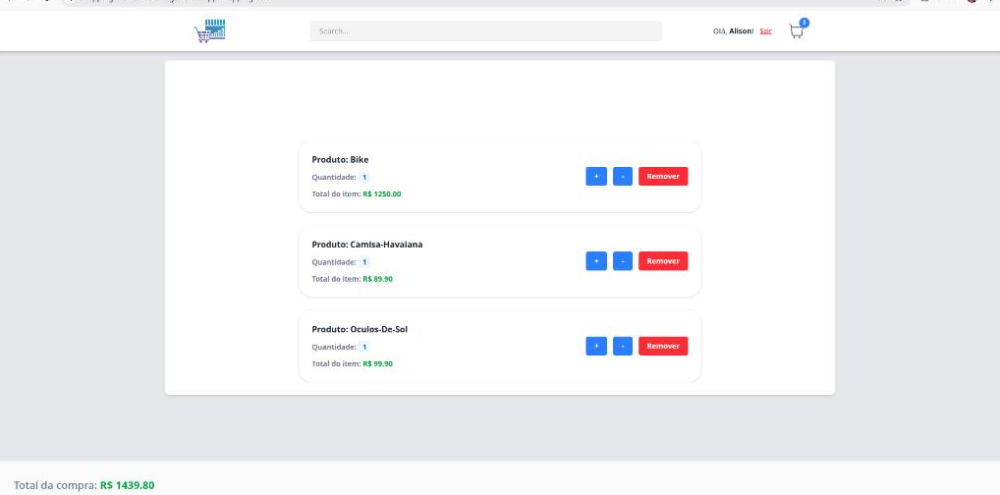
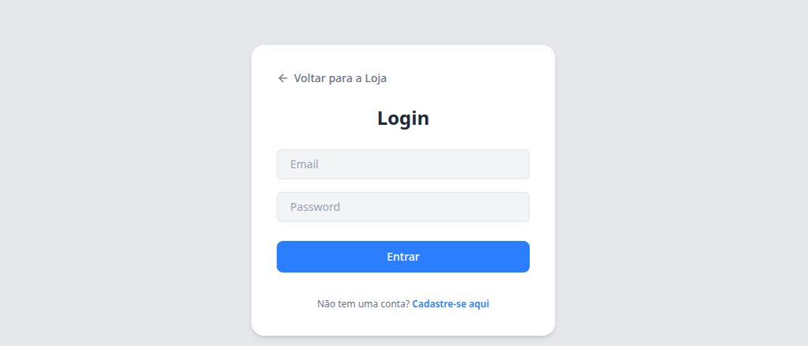

### 🛒 Shopping Market - E-Commerce

# 🛒 shoppingMarketTic

Uma aplicação web moderna para mercado e compras online.

## 🖥️ Telas do Projeto

<table align="center">
  <tr>
    <td align="center">
      <b>Tela Principal</b><br>
      
    </td>
    <td align="center">
      <b>Carrinho de Compras</b><br>
      
    </td>
  </tr>
  <tr>
    <td align="center" colspan="2">
      <b>Tela de Login</b><br>
      
    </td>
  </tr>
</table>

Este é um projeto de e-commerce completo com controle de carrinho de compras e sistema de autenticação estruturado em TypeScript. A aplicação foi originalmente iniciada como um projeto de estudo e, posteriormente, evoluída de forma independente para aplicar padrões avançados de engenharia de software e arquitetura de sistemas.

> 🎓 **Contexto de Desenvolvimento:** Base construída durante a trilha de aprendizado em React.js ofertada pela **TIC emtrilhas**.
> 🚀 **Evolução de Portfólio:** Por iniciativa própria e foco em evolução de carreira, realizei uma refatoração total da aplicação. Atualizei a stack para TypeScript estrito, reconstruí os contratos de integração com APIs, isolei fluxos de variáveis de ambiente e configurei uma arquitetura estável de deploy independente.

---

## 🛠️ Tecnologias e Frameworks Atualizados

- **React.js & Vite:** Setup moderno focado em alta performance e Hot Module Replacement (HMR).
- **TypeScript:** Implementação de tipagem estrita para segurança de dados entre componentes e requisições.
- **Tailwind CSS:** Estilização componentizada e responsiva com foco em otimização para telas desktop (1440px).
- **Axios:** Centralização de chamadas HTTP usando instâncias customizadas (`http-common.ts`).
- **TanStack Query (React Query):** Gerenciamento de cache assíncrono para buscas textuais otimizadas com debounce.
- **React Router Dom:** Gerenciamento de navegação e fluxos de autenticação.
- **JSON Server Base:** Mock API REST simulando o armazenamento persistente em banco de dados independente.

---

## 🏗️ Soluções de Engenharia Implementadas

- **Tratamento Dinâmico de Coleções:** Correção na camada de serviço para mapeamento e tratamento de respostas HTTP retornadas em formato de Array por APIs mockadas, adaptando-as para os estados locais do React.
- **Isolamento de Ambientes (CI/CD):** Separação rígida de chaves através de `.env.local` (desenvolvimento) e `.env.production` (produção), mantendo dados sensíveis protegidos via `.gitignore`.
- **Evolução de UX/UI:** Correção de concorrência na exibição do estado de login no cabeçalho (`Header.tsx`) e implementação de navegação de retorno fluida (`FiArrowLeft`) para evitar travamentos de formulários.

---

## 🚀 Como Executar o Projeto Localmente

O repositório está estruturado como um Monorepo, contendo tanto o cliente (frontend) quanto a API mockada (backend).

### 1. Clonar o Repositório
```bash
git clone https://github.com
cd shoppingMarketTic
```

### 2. Configurar e Iniciar o Servidor (Backend)
```bash
cd json-server-base
npm install
npm run start
```
*O servidor mock iniciará localmente na porta `3001`.*

### 3. Configurar e Iniciar a Aplicação (Frontend)
Abra um novo terminal na raiz principal do projeto:
```bash
npm install
npm run dev
```
*A aplicação frontend estará disponível em `http://localhost:5173`.*

---

## 🌐 Deploys Ativos

- **Front-end (Interface da Loja):** [Acesse a aplicação na Vercel](https://vercel.app)
- **Back-end (Serviço de API):** [Acesse o banco de dados no Render](https://onrender.com)
